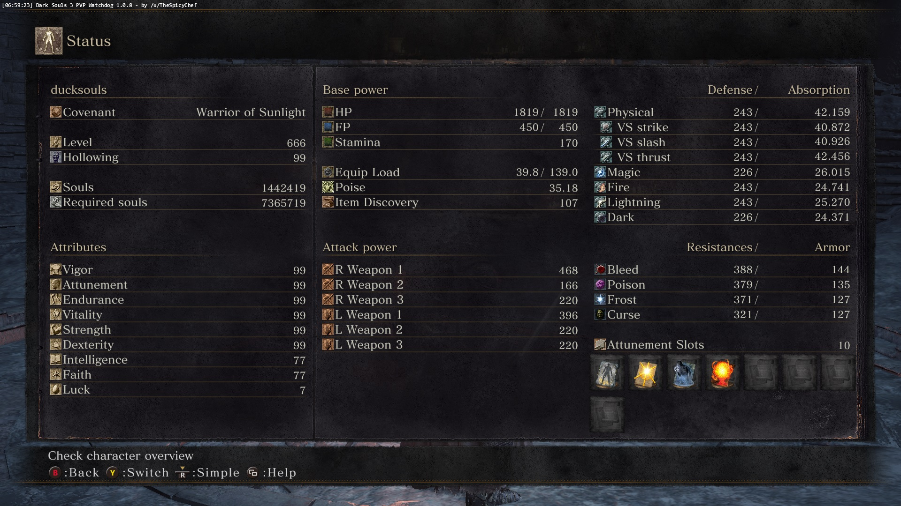

# Conclusion

When you start your speedrunning on the road to SL802, pay attention to which
weapons, items, and strategies work best for you for a particular area or boss.
Generally, you want to use strategies that you are comfortable with and allow
you to quickly dispatch of bosses. After speedrunning the game a few times, you
might notice there are a small number of weapons you use to effectively deal
with bosses and enemies _en route_ to the boss arenas. Remove any items you
don't need from your carry inventory and place them in storage. Your inventory
should be as uncluttered as possible to allow you to quickly swap to
soul-boosting items once a boss is defeated.

Here is a screenshot of the time my character joined the dark side and became
evil. Forgive me, I was young, naive, and new to speedrunning.

Here is the route I used to get from SL1 to SL802.

{% youtube id="lmD35QCf7vo", title="Any% speedrun to reach SL802, NG+69, glitch, Dark Souls III" %}

{% youtube id="Qne5e4EAgv8", title="Any% speedrun at SL802, NG+71, no glitch, Dark Souls III" %}

Happy speedrunning, power up thine dedication, and may the flame guide thee.
